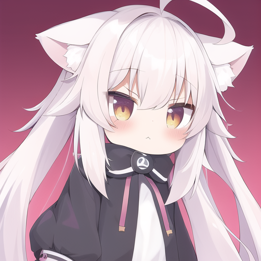

 

     
     <h1>Season Shi</h1>
     

         
             
             <a href="mailto: seasonshi@elyart.dev">seasonshi@elyart.dev</a>
         
         ·
         
             
             <a href="https://github.com/WhiteElytra">WhiteElytra</a>
         
         ·
         
             
             <a href="https://www.baiyi.moe">BaiYi.Moe</a>
         
     

 

 ##  个人信息 

 - 男，2006年
 - 工作经验：5 年

##  教育经历

- 高中在读。
- 研究，主要方向 **计算机科学**，**网络后端**，**人工智能**。

##  工作经历

- **Elyart Network，管理部门，创始人兼首席执行官，2020/3/25-至今**

##  项目经历

- **ZeroDream 项目** 发行商/维护者

  一款基于 Unity 开发的类音乐游戏，玩法源自 **跳舞的线** ，于 **跳舞的线** 官方确认停止运营后开发，在该游戏玩法基础上实现极致画质、开放社区铺面以及全平台的游戏支持，曾上架 **Apple Store** 等多个软件应用平台。

- **Forumia 项目** 维护者/开发者

  一款基于 Kotlin Web 框架 Ktor 开发的 CMS 内容管理系统框架，采用现代化技术栈开发，为达到轻量，快速，高效的目标。后改为 Golang 开发，进一步优化。

- **NekoMint 项目** 管理员/维护者

  NekoMint 又名 **猫薄荷幼儿园** 是一个为中国性少数群体搭建的中文交流社区。一个开放、多元的交流平台，分享与交流生活日常，医疗资源，知识科普。

- **NyaBot 项目** 管理员/维护者

  NyaBot 是一个使用 Golang 开发，跨平台、多语言插件的聊天机器人框架。通过一个兼容层，实现了不同机器人平台采用同一个快速执行库，开发者可以选择使用该库在同一套API下对不同平台开发功能。支持基于 Lua、Javascript、Wasm 的动态脚本加载与 gRPC 连接，为开发者提供多种开发方式的选择。

##  技能清单

- ★★★ 后端开发：常用后端服务框架（Gin，Ktor，NodeJS，Laravel）的基本功能。
- ★★★ 服务端运维：服务器常用操作系统发行版的搭建与基本运维。
- ★★☆ 服务架构：常见 Web 服务架构，无状态服务架构，云原生服务架构。
- ★★☆ 持续集成：常见持续集成平台（Jenkins，Teamcity，GitHub Actions）的使用与搭建。
- ★☆☆ 集群运维：Kubernetes 集群的高可用部署和简单运维。
- ★★★ 基本计算机科学知识与素养，基本商业管理知识，基本团队组织能力。

##  编程语言

- ★★★ Golang
- ★★★ PHP
- ★★☆ Kotlin
- ★★☆ C/C++
- ★☆☆ TypeScript
- ★☆☆ Java
- ★☆☆ C#

##  能力认证

- NOIP 2016届 省赛二等奖

  算法能力认证比赛。

- STEMA 蓝桥杯 第十一届 省赛二等奖

  算法能力认证比赛。

##  其他信息

- Alist 项目贡献者

  在 Alist 项目社群活跃，并为 Alist 项目提交 **下载签名** 功能。

- 个人喜好

  习惯与他人分享经验，团队合作完成项目。经常活跃于开源社区，支持自己喜欢的项目，为其提交修复补丁和新功能。